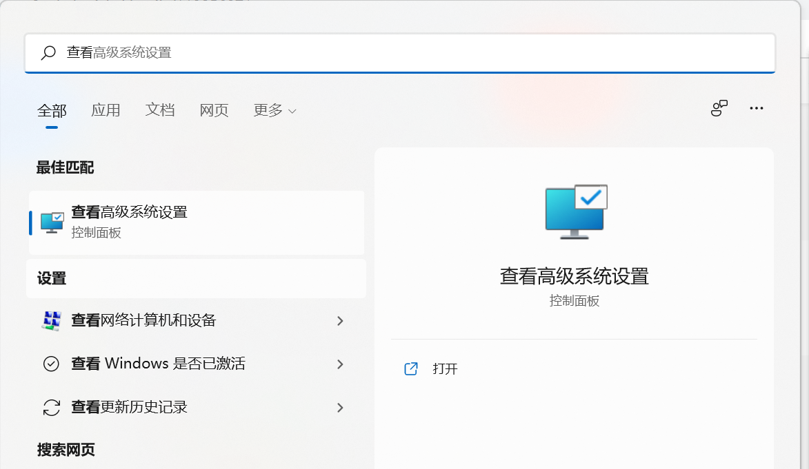

# 水排序自动求解程序
## 1. 依赖及环境配置
本程序需要adb-server服务开启后才能进行使用，请先下载adb并配置环境变量，连接上android设备后运行程序，***一定要确认adb已经连接上了设备！！！！！***

具体操作如下：
+ 项目下已经有一个adb目录，里面是下载好的adb以及相关链接库文件，将该adb文件夹路径添加到环境变量path中
    1. 打开windows搜索栏，搜索```查看高级系统设置```,点击进入
    

## 2. 安装步骤
```git clone ```