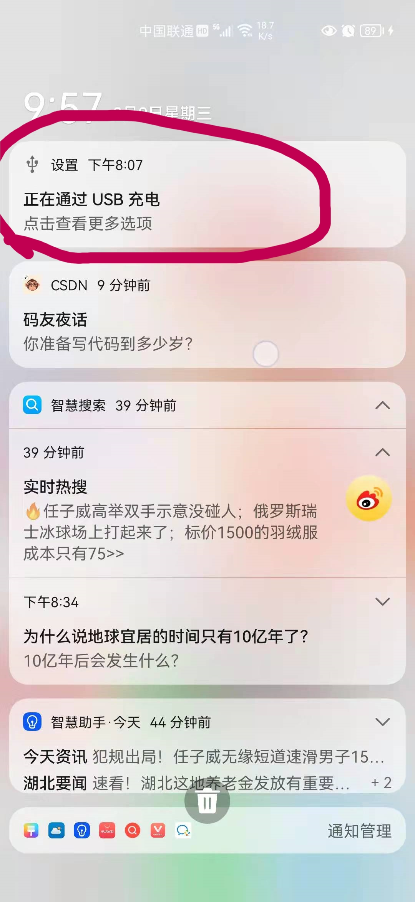
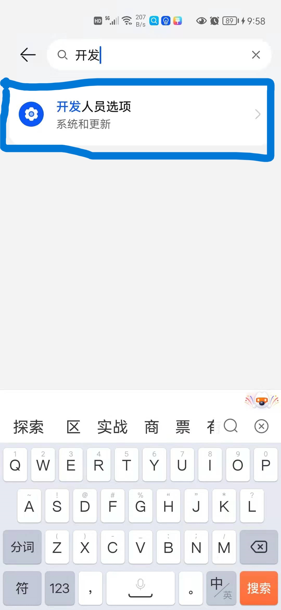
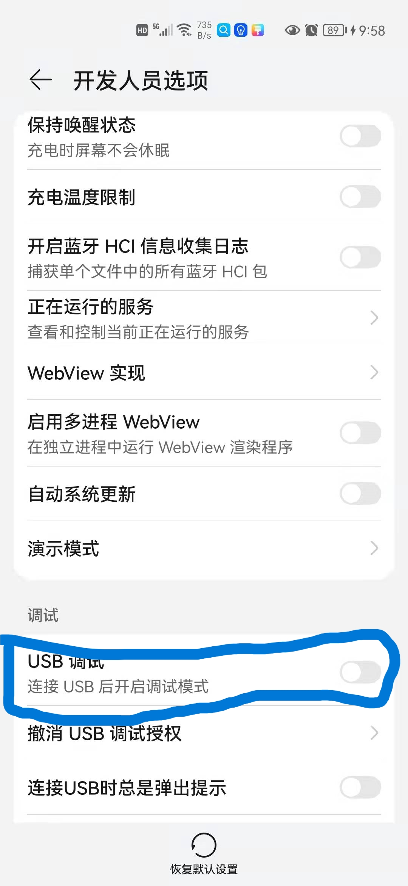
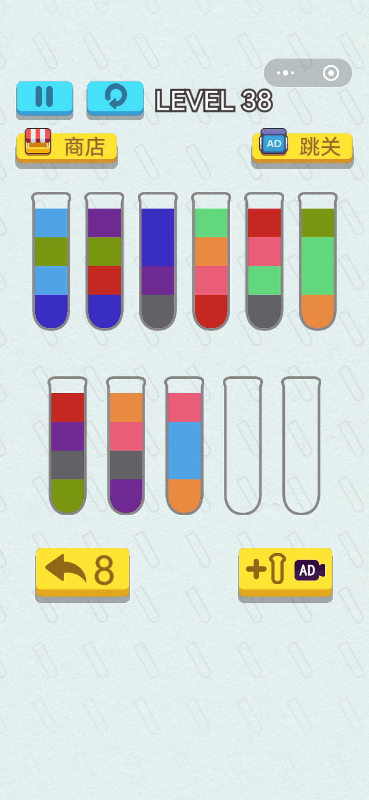
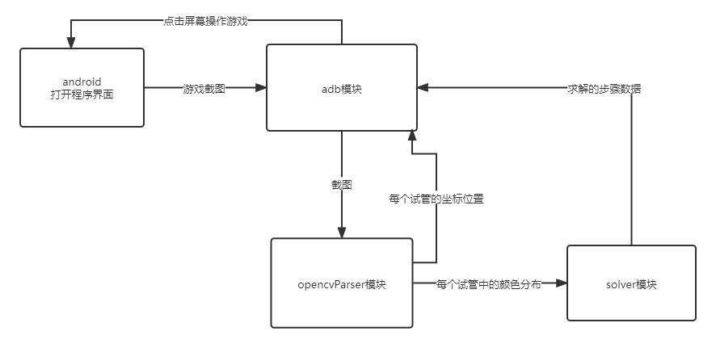

# WaterSortSolver(微信小程序 倒沙游戏自动求解脚本 水排序问题)

> 微信搜索小程序 ：开心拼一拼倒沙游戏

## 1. 设备

本程序目前仅支持Android以及鸿蒙系统手机，目前不支持ios手机

## 2. 安装方式

```
git clone https://gitee.com/zhou-antong/water-sort-solver.git
```

## 3. 依赖

```
pip install opencv-python

pip install numpy
```

## 4. 使用步骤

+ 检查上述依赖是否安装完毕

+ 将手机与电脑通过usb数据线连接！！！

+ 将手机连接方式从（仅充电）更改为（MIDI输入）
  
  
  
  

+ 打开手机设置，搜索开发者选项
  
  

+ 进入开发人员选项后，打开USB调试
  
  

+ 打开手机小程序界面到游戏开始时如图
  
  

+ 进入项目目录，运行main.py程序 ，等待脚本程序自动完成游戏

## 5. 项目涉及技术

+ **adb** 全称 **Android Debug Bridge** （安卓调试桥），主要是用于通过**命令行**对android系统手机进行调试，主要功能有，模拟手机触屏输入，可以代替手指点击屏幕；截取手机屏幕截图等等功能。

+ **opencv** 是c++开发的计算机视觉以及机器学习的软件库,已有面向python的接口，可以通过python 以及 numpy库来调用处理图像。

+ **dfs** 深度优先搜索 深度优先搜索属于图算法的一种，英文缩写为DFS即Depth First Search.其过程简要来说是对每一个可能的分支路径深入到不能再深入为止，而且每个节点只能访问一次.

## 6. 基本思路

由于该微信小程序在进行http的传输过程中对每次请求和响应都进行了未知加密算法以及未知密钥的加密，所以无法通过抓包或者网络爬虫的方式获取每个试管中的液体颜色以及位置等信息。

所以只能通过adb对游戏界面截图然后采用opencv对该图像分析获取相关试管的位置以及每个试管中的液体的颜色对数据进行抽象成python中的数据对象后再调用dfs算法模块solver进行求解，求解程序将结果以及步骤返回给adb模块，adb模块模拟点击相关位置进行对游戏操作。

具体调用关系如下图：



## 7. 模块开发

### adb模块开发

adb模块计划开发基于adb的手机Connector类来管理获取截图和控制点击某个像素坐标来操作游戏。adb相关exe文件从adb官网下载,adb下载配置教程：[教程]([adb下载安装及使用_Dongs丶的博客-CSDN博客_adb安装](https://blog.csdn.net/weixin_43927138/article/details/90477966))

adb是一个命令行工具，主要操作方法如下：

+ **确保已经将adb.exe所在目录添加到path环境变量中再进行下列操作 ！！！！！** 添加方法在教程中已有。

+ 将手机与电脑通过USB连接，打开手机设置搜索开发人员选项，打开USB调试，同时将手机usb连接（仅充电）更改为（MIDI输入）。

+ 打开cmd窗口，输入```adb devices``` 看到有设备连接成功后，再输入```adb shell input swipe 600 800 300 800 1000```,观察手机，可以看到手机出现类似手指滑动的效果，更多adb命令如下：[adb常用命令]([GitHub - mzlogin/awesome-adb: ADB Usage Complete / ADB 用法大全](https://github.com/mzlogin/awesome-adb))里的README.md文档里介绍的非常详细

### opencv parser模块开发

游戏截图如下：


opencv模块需要从该图片中分析获得每个试管中心对应在图中的像素坐标，以及给所有试管中的不同颜色进行编号，例如给绿色编号为0，给红色编号为1，注意即使看起来是同一种颜色，但是对像素点进行取rgb值时可能都不一样，所以不能通过rgb来区分颜色，需要转换为hsv模式来对颜色进行判断和计算hsv颜色空间距离来区分不同颜色。


## 8. END

最后感谢神犇代码贡献者[@LittlerLamb](https://github.com/LittlerLamb)
